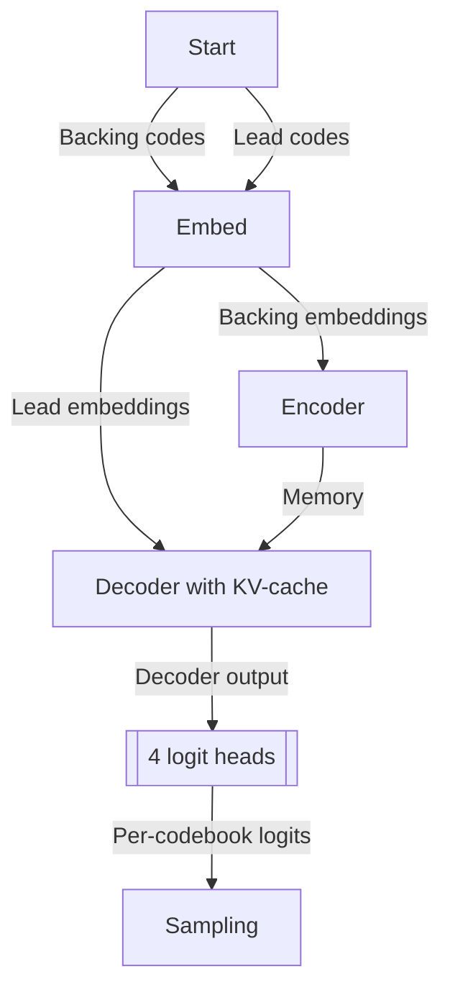
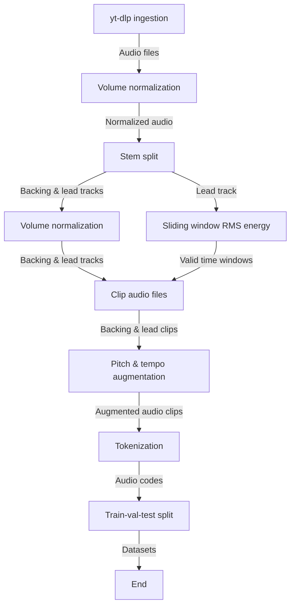

# SaxGPT: Audio Encoder-Decoder Transformer

A multi-stream encoder-decoder transformer trained to generate saxophone solos on jazz backing tracks. SaxGPT uses neural audio tokenization and a custom architecture to learn the relationship between rhythm sections and saxophone improvisations.

## Overview

SaxGPT takes a jazz backing track as input and generates an accompanying saxophone solo. The model uses:
- **Encodec** for audio tokenization (4 parallel token streams at 50Hz)
- **Encoder-decoder transformer** with KV-caching for efficient generation
- **Multi-codebook embeddings** with delay pattern interleaving for better convergence
- **Flash Attention 2** for memory-efficient training and inference

### Key Features
- Custom dataset creation from YouTube jazz recordings
- Source separation using Demucs to isolate saxophone and rhythm tracks
- Multi-stream token generation with delayed codebook patterns
- Mixed precision training (FP16) with gradient accumulation
- Full KV-caching support for fast inference
- Distributed Data Parallel (DDP) training support
- Google Cloud Platform (GCP) Vertex AI integration

## Architecture

The model consists of:
- **Encoder**: Processes tokenized backing track audio (rhythm section)
- **Decoder**: Generates tokenized saxophone audio autoregressively
- **4 parallel token streams** per audio (from Encodec), each with vocab size 2048
- **Delay pattern interleaving**: Each codebook starts at a different position for better convergence



## Installation

### Requirements
- Python 3.9+ (for Demucs)
- Python 3.10+ (for training)
- CUDA-compatible GPU recommended
- FFmpeg (for audio processing)

### Setup

1. Clone the repository:
```bash
git clone https://github.com/pqienso/SaxGPT
cd SaxGPT
```

2. Create virtual environments for data processing:
```bash
bash scripts/build_venvs.sh
```

This creates 3 separate environments:
- `.venv/demucs` - For stem separation with Demucs
- `.venv/encodec` - For audio tokenization with Encodec
- `.venv/eval` - For evaluation (due to many dependencies needed for the FAD library)

## Dataset Creation

### 1. Configure Your Data

Create or modify a config file in `config/data/`:

```yaml
url: 'https://www.youtube.com/playlist?list=YOUR_PLAYLIST_ID'

data_paths:
  dl_dir: 'data/your_dataset/1_download/'
  stems_dir: 'data/your_dataset/2_stems/'
  metadata_path: 'data/your_dataset/3_metadata.csv'
  clips_dir: 'data/your_dataset/4_clips/'
  aug_dir: 'data/your_dataset/5_aug_clips/'
  codes_dir: 'data/your_dataset/6_codes/'
  datasets_dir: 'data/your_dataset/7_datasets/'

intermediates: # keep / discard intermediate outputs
  keep_dl: true
  keep_stems: true
  keep_clips: true
  keep_aug_clips: true
  keep_codes: true

demucs:
  n_splits: 2          # Higher = higher quality, slower
  n_shifts: 2          # Averaging shifts for equivariance
  n_jobs: 16           # Parallel jobs
  normalize_before: true
  normalize_after: true

rms_window:
  rms_threshold: 0.05  # Minimum RMS energy for valid sections
  min_window_size_seconds: 30.0
  rms_frame_length_seconds: 10.0
  rms_stride_seconds: 0.2

augmentation:
  sample_rate: 32000
  semitone_steps: [-2, 2]  # Pitch shift range
  tempo_ratios: [0.9, 1.1]  # Speed adjustment range
  n_fft: 4096
  hop_length: 512

encodec:
  chunk_len_s: 25      # Process audio in chunks to manage memory

train_test_split:
  seed: 67
  test: 0.1            # 10% test set
  val: 0.1             # 10% validation set

dataset:
  seq_len: 1500        # 30 seconds at 50Hz
  stride: 300          # Stride for overlapping windows
  padding_idx: 2048
```

### 2. Build the Dataset

```bash
bash scripts/run_data_pipeline.sh --config config/data/your_config.yaml [--cuda]
```

This pipeline:
1. **Downloads** audio from YouTube
2. **Separates** stems using Demucs (sax vs rhythm section)
3. **Creates** metadata with valid audio windows (RMS-based filtering)
4. **Clips** audio to extract relevant sections
5. **Augments** audio with pitch/tempo variations (optional)
6. **Tokenizes** audio using Encodec
7. **Splits** into train/val/test sets

#### Data pipeline flowchart


**Note**: The `--cuda` flag enables GPU acceleration for stem separation and tokenization.

## Training

### 1. Configure Training

Create or modify a config file in `config/model/`:

```yaml
data:
  train_path: "data/your_dataset/7_datasets/train.pt"
  val_path: "data/your_dataset/7_datasets/val.pt"
  test_path: "data/your_dataset/7_datasets/test.pt"

model:
  vocab_size: 2049           # 2048 tokens + padding
  num_codebooks: 4
  d_model: 384
  nhead: 6
  num_encoder_layers: 6
  num_decoder_layers: 6
  dim_feedforward: 1536
  dropout: 0.1
  activation: "relu"
  norm_first: true           # Pre-norm architecture
  max_seq_len: 1505
  padding_idx: 2048
  scale_embeddings: true

training:
  num_epochs: 1000
  batch_size: 4
  gradient_accumulation_steps: 8  # Effective batch size = 32
  
  scheduler:
    type: "cosine"           # cosine, linear, step, plateau
    warmup_steps: 1000
    total_steps: null        # Auto-calculated if null
    min_lr: 1.0e-6
  
  optimizer:
    type: "adamw"
    lr: 0.0003
    embedding_lr: null       # Optional: different LR for embeddings
    betas: [0.9, 0.98]
    eps: 1.0e-9
    weight_decay: 0.01
  
  output_dir: "models/your_model"
  log_interval: 50           # Log metrics every N steps
  save_interval: 100         # Save checkpoint every N epochs
  num_workers: 2
  use_pbar: true             # Show progress bars
  
  resume_from_checkpoint: null  # Or path to checkpoint
```

### 2. Start Training

**Single GPU:**
```bash
python -m src.training.train --config config/model/your_config.yaml
```

**Multi-GPU with torchrun:**
```bash
torchrun --nproc_per_node=4 src/training/train.py --config config/model/your_config.yaml
```

**Multi-GPU with spawn:**
```bash
python -m src.training.train --config config/model/your_config.yaml --ddp --num-gpus 4
```

Training features:
- Mixed precision (FP16) with gradient scaling
- Gradient accumulation for large effective batch sizes
- Automatic checkpointing (best model + periodic saves)
- Interrupt recovery (Ctrl+C saves checkpoint)
- JSONL metrics logging for real-time monitoring
- Distributed training support (DDP)

### 3. Monitor Training

**Text monitoring:**
```bash
python -m src.training.monitor_metrics --config config/model/your_config.yaml --watch
```

**Live plotting:**
```bash
python -m src.training.monitor_metrics --config config/model/your_config.yaml --live
```

**Static plot:**
```bash
python -m src.training.monitor_metrics \
    --config config/model/your_config.yaml \
    --plot \
    --output training_progress.png
```

### 4. Resume Training

If training is interrupted:
```bash
# The checkpoint path is automatically saved in config
python -m src.training.train --config config/model/your_config.yaml
```

## Evaluation

Comprehensive evaluation suite including:
- Loss and accuracy metrics
- Generation quality at different temperatures
- Autoregressive consistency checks
- Token distribution analysis (KL divergence)
- Fréchet Audio Distance (FAD) scoring
- Audio sample generation

```bash
python -m src.eval.evaluate \
    --config config/model/your_config.yaml \
    --checkpoint models/your_model/checkpoints/best.pt \
    --output-dir models/your_model/evaluation \
    --fad-samples 50 \
    --cuda
```

## Cloud Training (GCP Vertex AI)

### 1. Build and Push Docker Image

```bash
# Set environment variables
source ./vertex_config.env

# Build and push
bash scripts/build_docker.sh
```

### 2. Submit Training Job

```bash
python -m src.training.submit_vertex_training \
    --project-id YOUR_PROJECT_ID \
    --region us-central1 \
    --bucket YOUR_BUCKET_NAME \
    --config config/model/vertex_ai/xlarge.yaml \
    --image-uri YOUR_IMAGE_URI \
    --machine-type n1-standard-16 \
    --accelerator-type NVIDIA_TESLA_V100 \
    --accelerator-count 4 \
    --spot  # Optional: use spot instances for 80% cost savings
```

## Project Structure

```
SaxGPT/
├── config/
│   ├── data/              # Data pipeline configurations
│   └── model/             # Model training configurations
│       └── vertex_ai/     # Cloud training configs
├── src/
│   ├── data/
│   │   ├── pipeline/      # 7-step data processing pipeline
│   │   └── util/          # Audio processing utilities
│   ├── model/
│   │   ├── transformer.py # Main model architecture
│   │   ├── encoder.py     # Transformer encoder
│   │   ├── decoder.py     # Transformer decoder
│   │   ├── attention.py   # Flash Attention 2 implementation
│   │   └── codebook_layers.py  # Multi-codebook embeddings
│   ├── training/
│   │   ├── train.py       # Unified training script (single/multi-GPU)
│   │   ├── monitor_metrics.py  # Training monitoring
│   │   └── util/          # Training utilities (DDP, checkpointing, etc.)
│   └── eval/
│       └── evaluate.py    # Comprehensive evaluation suite
├── requirements/
│   ├── demucs.txt        # For stem splitting (Python 3.9)
│   ├── encodec.txt       # For training (Python 3.10+)
│   └── vertex_ai.txt     # For cloud training
├── scripts/
│   ├── build_venvs.sh
│   ├── run_data_pipeline.sh
│   └── build_docker.sh
├── Dockerfile            # For Vertex AI training
└── tests/                # Unit tests
```

## Model Sizes

Pre-configured model sizes:

| Model | Parameters | d_model | Layers (Enc/Dec) | Config |
|-------|-----------|---------|------------------|--------|
| XSmall | ~4M | 128 | 4/4 | `config/model/xsmall.yaml` |
| Small | ~15M | 256 | 6/6 | `config/model/small.yaml` |
| Medium | ~31M | 384 | 6/6 | `config/model/medium.yaml` |
| Large | ~60M | 512 | 8/8 | `config/model/large.yaml` |
| XLarge | ~210M | 768 | 12/12 | `config/model/vertex_ai/xlarge.yaml` |

## Technical Details

### Audio Tokenization
- **Sample rate**: 32kHz
- **Token rate**: 50Hz (20ms frames)
- **Codebooks**: 4 parallel streams
- **Vocabulary**: 2048 tokens per codebook (+ 1 padding token)
- **Delay pattern**: CB0 starts at t=1, CB1 at t=2, CB2 at t=3, CB3 at t=4

### Attention Mechanism
- Flash Attention 2 for memory efficiency
- KV-caching for fast autoregressive generation
- Causal masking for decoder self-attention
- Proper handling of padding masks
- Combined mask computation for optimal performance

### Training Optimizations
- Mixed precision (FP16) training
- Gradient accumulation for larger batch sizes
- Gradient clipping (default: 1.0)
- Learning rate scheduling:
  - Cosine with warmup (recommended)
  - Linear with warmup
  - Step decay
  - ReduceLROnPlateau
- Distributed Data Parallel (DDP) support
- Interrupt recovery with automatic checkpoint saving

### Advanced Features
- **Scheduled Sampling**: Gradually transition from teacher forcing to model predictions
- **Token Distribution Analysis**: KL divergence tracking for monitoring model behavior
- **FAD Scoring**: Perceptual audio quality metrics using VGGish embeddings
- **GCS Integration**: Direct support for Google Cloud Storage paths

## Evaluation Metrics

The evaluation suite provides:

1. **Basic Metrics**:
   - Cross-entropy loss
   - Token-level accuracy
   - Perplexity
   - Per-codebook metrics

2. **Generation Quality**:
   - Multi-temperature sampling
   - Top-k and nucleus (top-p) sampling
   - Sequence-level accuracy

3. **Consistency Checks**:
   - Autoregressive vs teacher-forcing consistency
   - First divergence position detection

4. **Distribution Analysis**:
   - Vocabulary coverage (unique tokens)
   - Token distribution entropy
   - KL divergence (target vs predicted)

5. **Perceptual Quality**:
   - Fréchet Audio Distance (FAD)
   - Audio sample generation

## Known Issues & Limitations

1. **Data requirements**: Model requires substantial training data (100+ hours recommended)
2. **Overfitting**: Small datasets lead to overfitting; regularization techniques help but are not a complete solution
3. **Audio quality**: Generated audio quality depends on Encodec compression artifacts
4. **Data leakage**: Some bleeding of source audio into target audio due to limitations of 6-stem Demucs model
5. **Computational cost**: Training requires GPU with ≥16GB VRAM for medium models, more for larger models

## References

- **MusicGen**: [Copet et al., 2023](https://arxiv.org/pdf/2306.05284) - Delay pattern and multi-codebook inspiration
- **Encodec**: [Défossez et al., 2022](https://arxiv.org/pdf/2210.13438) - Neural audio codec
- **Demucs**: [Rouard et al., 2022](https://arxiv.org/abs/2211.08553) - Music source separation
- **Flash Attention 2**: [Dao et al., 2023](https://arxiv.org/abs/2307.08691) - Efficient attention mechanism
